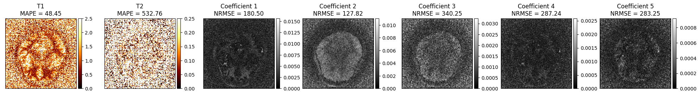

# Phisics informed guided diffusion for accelerated multi-parametric MRI reconstruction
_By Perla Mayo, Carolin M. Pirkl, Alin Achim, Bjoern Menze and Mohammad Golbabaee_

This repository contains the source code for the work titled
**Physics informed guided diffusion for accelerated multi-parametric MRI
reconstruction** ([arXiv](https://arxiv.org/abs/2506.23311)), which is based on [guided-diffusion](https://github.com/openai/guided-diffusion).
This work is to appear in the proceedings of MICCAI'25.

## Abstract
We introduce MRF-DiPh, a novel physics informed denoising diffusion 
approach for multiparametric tissue mapping from highly accelerated, 
transient-state quantitative MRI acquisitions like Magnetic Resonance 
Fingerprinting (MRF). Our method is derived from a proximal splitting 
, incorporating a pretrained denoising diffusion model as an effective 
image prior to regularize the MRF inverse problem. Further, during 
reconstruction it simultaneously enforces two key physical constraints: 
(1) k-space measurement consistency and (2) adherence to the Bloch 
response model. Numerical experiments on in-vivo brain scans data show 
that MRF-DiPh outperforms deep learning and compressed sensing MRF 
baselines, providing more accurate parameter maps while better 
preserving measurement fidelity and physical model consistency-critical 
for solving reliably inverse problems in medical imaging.

---
## Table of contents
1. [The MRF-DiPh Environment](#environment)
2. [File Structure](#file-structure)
2. [Dataset](#dataset) 
   1. [The Dataset Script File](#dataset-script) 
3. [Training](#training)
4. [Sampling](#sampling)
5. [Results](#results)
   1. [Conditional Sampling](#results-conditional)
   2. [Unconditional Sampling](#results-unconditional)

---

## 1. File Structure <a name='file-structure'/>
This repository contains the following directories:

```
mrf-diph
└-- datasets -- data used for training and validation. This contains the subdirectories:
|   └-- Deli-CS
|       └-- adjoint_tsmi -- low quality reconstructions, used as condition during training and sampling
|       └-- qmaps -- reference Q-Maps, required for validation
|       └-- reference_tsmi -- reference TSMIs, required for validation
|       └-- synthesized_ksp -- highly accelerated k-space synthesized from reference TSMIs with added Gaussian noise to simulate corrupted adquisitions
└-- evaluations
|   └-- experimental_results.py -- sample script to produce some images and plots
└-- guided_diffusion -- (mostly) original diffusion work, some scripts have been modified to handle properly the MRF data
|   └-- dist_util.py
|   └-- fp16_util.py
|   └-- gaussian_diffusion.py
|   └-- logger.py
|   └-- losses.py
|   └-- mrf_image_dataset_2d.py -- !!! sample script for MRF dataset
|   └-- nn.py
|   └-- resample.py
|   └-- respace.py
|   └-- script_util.py
|   └-- train_util.py
|   └-- unet.py
└-- models
|   └-- cut_3_imgsize_224_conditional
|       └-- mrfdiph_samples_lambda<lambda_value_used_during_sampling>
|       |   └-- *.npz -- output of MRF-DiPh
|       └-- ema_0.9999_100000.pt
|       └-- model100000.pt
|       └-- opt100000.pt
|   └-- cut_3_imgsize_224_unconditional
|       └-- mrfdiph_samples_lambda<lambda_value_used_during_sampling>
|       |   └-- *.npz -- output of MRF-DiPh
|       └-- ema_0.9999_100000.pt
|       └-- model100000.pt
|       └-- opt100000.pt
└-- mrf_processing
|   └-- delics_data_preparation.py
|   └-- delics_intensity_inspection.py
|   └-- utils.py
|   └-- utils_acquisition2d.py
|   └-- utils_dm_exact.py
|   └-- SVD_dict_FISP_cut3.mat
|   └-- traj_dcf.mat
└-- scripts
|   └-- mrf_sample_mrfdiph.py
|   └-- mrf_train_2d.py
└-- sample_mrf_2d_mrfdiph_conditional.sh
└-- sample_mrf_2d_mrfdiph_unconditional.sh
└-- train_mrf_2d_mrfdiph_conditional.sh
└-- train_mrf_2d_mrfdiph_unconditional.sh
└-- mrf-diph-env.txt
└-- LICENSE
└-- README.md
└-- setup.py
```

---
## 2. The MRF-DiPh environment <a name='environment'/>
The explicit list of the packages in the final conda environment is provided in [mrf-diph-env.txt](./mrf-diph-env.txt),
in hopes to facilitate reproducibility of this work.

---
## 3. Dataset <a name='dataset'/>
The data used for the published work is confidential and therefore cannot
be shared, however, we provide a demo using the publicly available dataset
from [Deli-CS](https://pmc.ncbi.nlm.nih.gov/articles/PMC11914339/). 
The demo also contains the code used to generate the reference Q-Maps 
as well as the low-quality reconstructions from simulated highly-accelerated
k-space data. The code to do this is provided under
[mrf-diph/mrf_processing/delics_data_preparation.py](https://github.com/p-mayo/mrf-diph/mrf_processing/delics_data_preparation.py).
It requires the following data files:

* **path to qmaps** - path to folder containing reference Q-Maps
(T1, T2, complex PD), these are the input and main source for the 
synthesized data required by MRF-DiPh. Masks required for validation
are also contained in this directory.
* **SVD dictionary** -- for SVD compression for the required # of timeframes.
* **k-space trajectory and DCF** -- required by the adjoint and
forward operators.

Our script organizes the data in the following directories:

* **reference_tsmi** --SVD-compressed TSMI, simulated from reference Q-Maps. 
Relevant function used in script: get_tsmis_reference_from_qmaps()

* **synthesized_ksp** -- highly accelerated k-space from reference TSMI. 
Relevant function used in script: get_kspace_from_reference_tsmi()

* **adjoint_tsmi** -- output of adjoint operator on synthesized k-space.
Relevant function used in script: get_tsmis_adjoint_svd_from_kspace()

We also provide the code used for the forward and adjoint operators as
well as the code for Dictionary Matching used at sampling step for
estimation of Q-Maps from SVD-compressed TSMI.

### 3.1 The Dataset Script File <a name='dataset-script'/>
The dataset script file is found under [mrf-diph/guided_diffusion/mrf_image_dataset_2d.py](https://github.com/p-mayo/mrf-diph/guided_diffusion/mrf_image_dataset_2d.py),
which is based on the original dataset file in guided_diffusion, and 
adapted to process the MRF data. 
It expects the paths for the reference TSMIs as well as the low-quality
(adjoint) reconstructions from the accelerated k-space acquisitions
(simulated in this demo).

---
## 4. Training <a name='training'/>
The training python script as well as a bash script with the parameters required
are provided to facilitate reproducibility of MRF-DiPh. Make sure to indicate
whether condition is to be used or not by specifying the parameter and the cut
(ID for acceleration):

```
--use_condition [True|False]
--cut 3
```

Other training parameters used for MRF-DiPh are:
```
--difusion_steps 1000
--attention_resolutions '28,14,7'
--image_size 224
```

Additional parameters can be found in the relevant bash script. 

---

## 5. Sampling  <a name='sampling'/>
Sampling scripts, both python and bash, are provided in the repository.
Like training, the parameters used for MRF-DiPh and the demo
are provided to facilitate reproducibility of MRF-DiPh. Make sure to indicate
whether condition is to be used or not by specifying the parameter,
these should match those used during training:

```
--use_condition [True|False]
--cut 3
```

Other sampling parameters required by MRF-DiPh are:
```
--dict_match True      # Use dictionary matching step during sampling
--proximal True        # Use proximal operator (k-space consistency term)
--max_iters 5          # Max. number of iterations for CG gradiante (proximal) step
--timesteps 30         # Sampling steps during reverse diffusion
--gamma 0.01           # Convergence hyperparameter
--gamma_fixed False    # If gamma should not be derived from mu
--lambda 0.0001        # Trade-off term for diffusion (denoising) prior
--xi 1.0               # Term to balance added noise (deterministic and stochastic)
                       # during sampling
--checkpoint 100000    # Checkpoint model to use for sampling
```

It is also possible to specify any volume(s) and slice(s) to reconstruct
with the sampling script, just include this in the bash script:

```
--test_vols 0          # Volume numbers (appearing in file name)
--test_slices 5,10,15  # Slice numbers (appearing in file name)
```

Lastly, to track progress, i.e. output reconstruction images and
log some reconstruction metrics during sampling, simply indicate
the following:

```
--report True
```

Additional parameters can be found in the relevant bash script. 

---
## 6. Results  <a name='results'/>
To visualize the results, MRF-DiPh outputs a .npz file containing the various 
samples generated during inference, i.e. $\mathbf{x}_t, \mathbf{z}_t, \hat{\mathbf{x}}_t, $ and 
$\tilde{\mathbf{x}}_t$, as well as the Q-Maps. For instance, to extract the content of the file
we can simply:

```python
import numpy as np

x_tilda = np.load("<path-to-.npz>")['x_tilda'] # For the TSMI output of diffusion model
x_hat = np.load("<path-to-.npz>")['x_hat'] # For the TSMI output of proximal step
z_t = np.load("<path-to-.npz>")['z_t'] # For the TSMI output of the dictionary matching step
qmaps = np.load("<path-to-.npz>")['qmaps'] # For the Q-Maps output of the dictionary matching step
```

We can assess the effect of $\lambda$ (trade-off parameter between
physics guidance and denoising/diffusion prior). Below we provide 
samples of reconstructions following the conditional and
unconditional sampling schemes for varying $\lambda$ for a single
slice. Each reconstruction is provided along with reconstruction errors.

Both sampling strategies exhibit a sweet spot when choosing $\lambda$,
as very small values (i.e. more physics guidance) fail to fully remove
the corruption present in the k-space, while very large values impact
the fidelity to k-space (measurements), and thus reduces the confidence
in the reconstruction. This is better visualized in the below plots.


### Conditional Sampling <a name='results-conditional'/>




### Unconditional Sampling <a name='results-unconditional'/>


